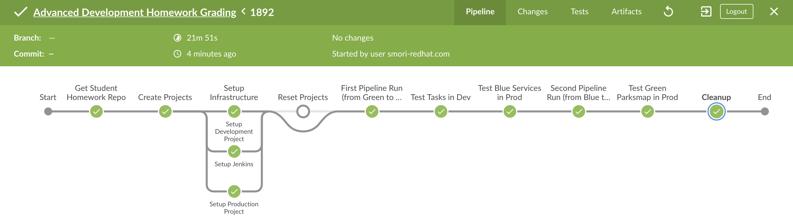

# OpenShift Advanced Development Homework Submission Document
This is the document for submission of OpenShift Advanced Development Homework.

## Repository
All source codes(including setup shell, Jenkins pipeline, application code...) is in following repository.

https://github.com/mosuke5/advdev_homework_template

## Successful build
Sccessful build number is #1892.

